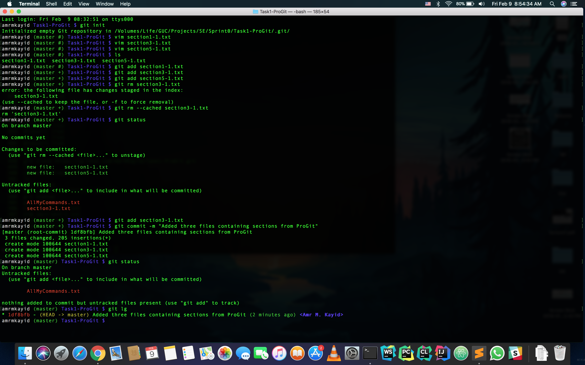
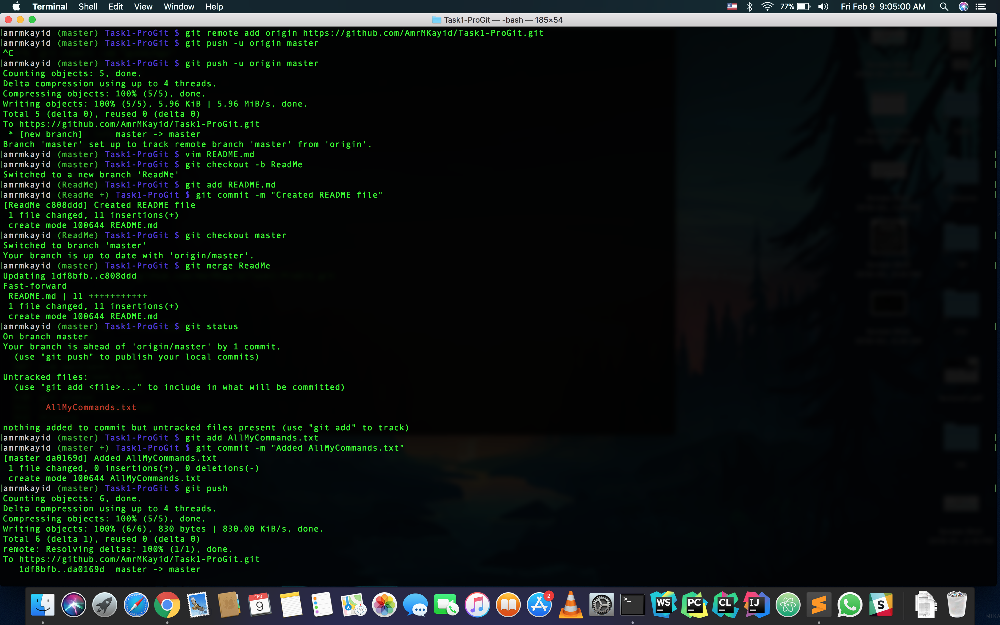

<h1 align="center">  Github - Sprint 0 </h1>

## Getting Started:
This repo is made for the first Task of my Software Engineering Project, it contains sections from ProGit Book.

### Author:
* **Amr M. Kayid** - [AmrMKayid](https://github.com/AmrMKayid) | 37-15594

### Acknowledgments:
(book Chacon, Scott, and Ben Straub. Pro Git. Apress, 2014.)

## Workflow:

First Pic                  |  Second Pic
:-------------------------:|:-------------------------:
              |  

